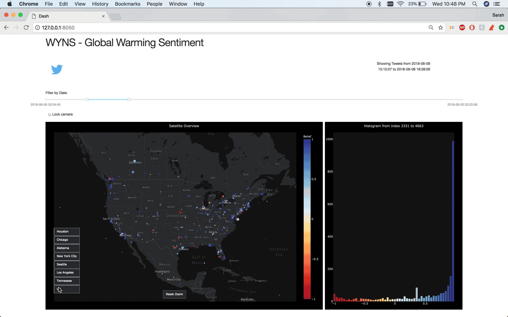

[](https://travis-ci.org/sarahalamdari/DIRECT_capstone) [](https://coveralls.io/github/sarahalamdari/DIRECT_capstone?branch=master)

# WYNS: A Tool for Anaylzing Twitter Sentiment on Climate Change




## Installation 
### Dependencies 
- Python 3.6 
- Dash 0.21.0 

### How to Install 
```
***git clone repository*** ~not a package~ 
conda create -n py36 python=3.6 anaconda
source activate py36 
pip install -r requirements.txt 
```

Also make sure to install the following dash libraries 
```
pip install dash==0.21.0  # The core dash backend
pip install dash-renderer==0.11.3  # The dash front-end
pip install dash-html-components==0.9.0  # HTML components
pip install dash-core-components==0.18.1  # Supercharged components
pip install plotly --upgrade  # Latest Plotly graphing library
```

## Development 
WYNS is our capstone project for the [DIRECT](http://depts.washington.edu/uwdirect/) Program, currently under development. 


### Authors
Sarah Alamdari,
Wesley Beckner,
Neal Dawson-Elli,
Yusong Liu

